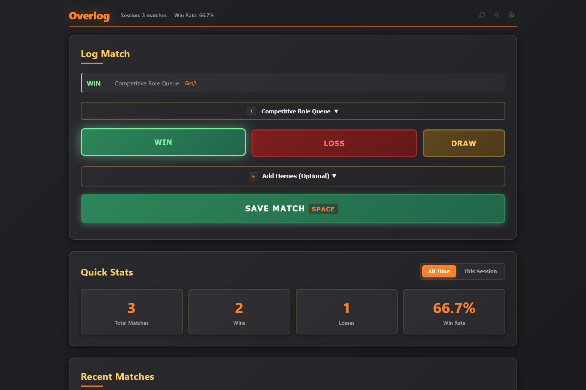

# Overlog

A simple, fast match logger for Overwatch. Track your wins, losses, and performance across different game modes and sessions with keyboard shortcuts and navigation.

## Features

- **Match Logging** - Quick win/loss/draw tracking with optional hero selection
- **Multiple Game Modes** - Support for Competitive, Unranked, Stadium, and Arcade
- **Session Tracking** - Monitor performance within gaming sessions
- **Statistics** - View overall and per-session win rates and match counts
- **Data Export** - Export your match history to CSV or JSON
- **Keyboard Shortcuts** - Fast navigation and logging with WASD and hotkeys
- **Theme Support** - Dark, light, and automatic theme modes
- **Local Storage** - All data stored locally in your browser

## Usage

Open the app and start logging matches:

1. Select your match type
2. Click Win, Loss, or Draw
3. Optionally add heroes played
4. Press Space (or click Save Match)

Use keyboard shortcuts for faster logging:
- **WASD** - Navigate between buttons
- **Space** - Save match
- **Ctrl+Z** - Undo last match
- **Number keys** - Select match types
- **T** - Toggle match type section
- **E** - Toggle hero section

## Data Management

- **Export** - Download your match history as CSV or JSON
- **Import** - Restore previously exported data
- **Clear** - Reset all stored data

All data is stored locally in your browser. Regular exports are recommended for backup.

## Settings

Customize the app behavior:
- Theme preferences (dark/light/auto)
- Recent heroes quick-select count
- Auto-collapse sections
- Session auto-reset options
- Keyboard shortcut toggles

## Development

This project was developed with assistance from AI tools (Claude Code).

## License

This project is licensed under the GNU General Public License v3.0 - see the [LICENSE.md](LICENSE.md) file for details.
